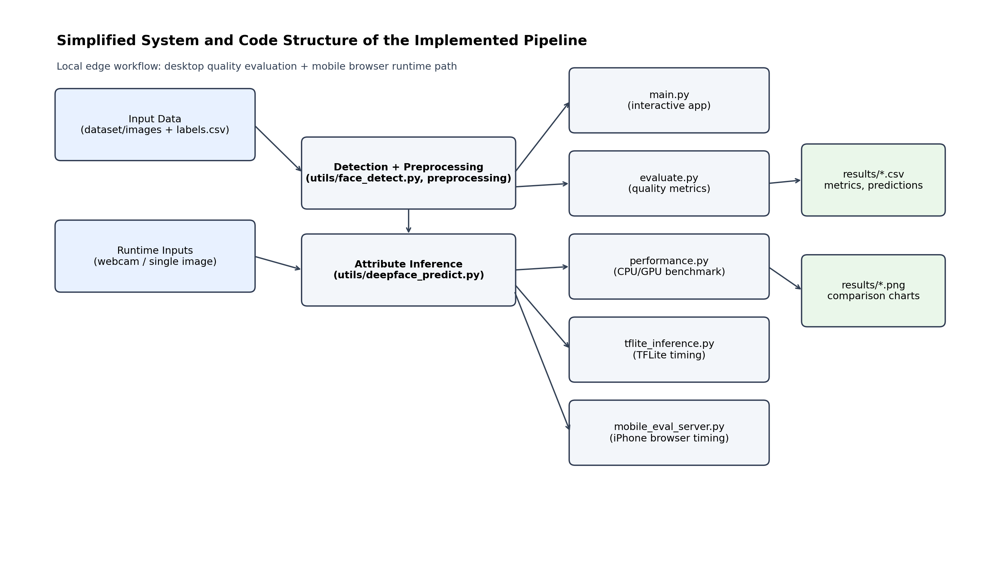
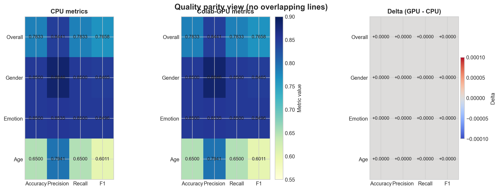
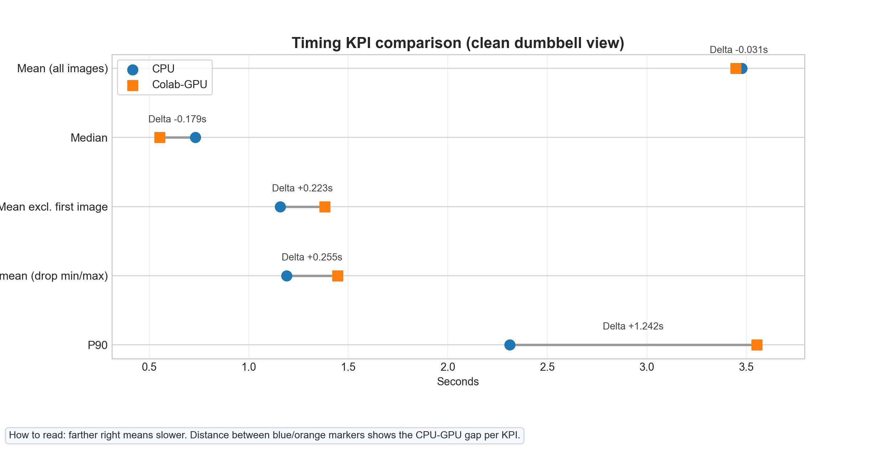
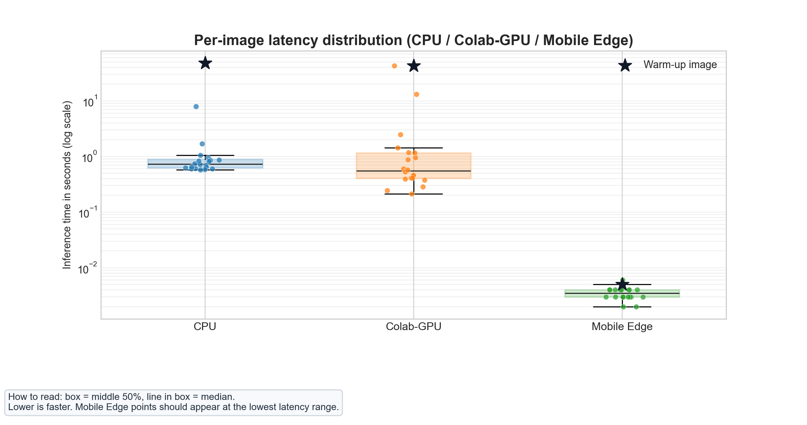
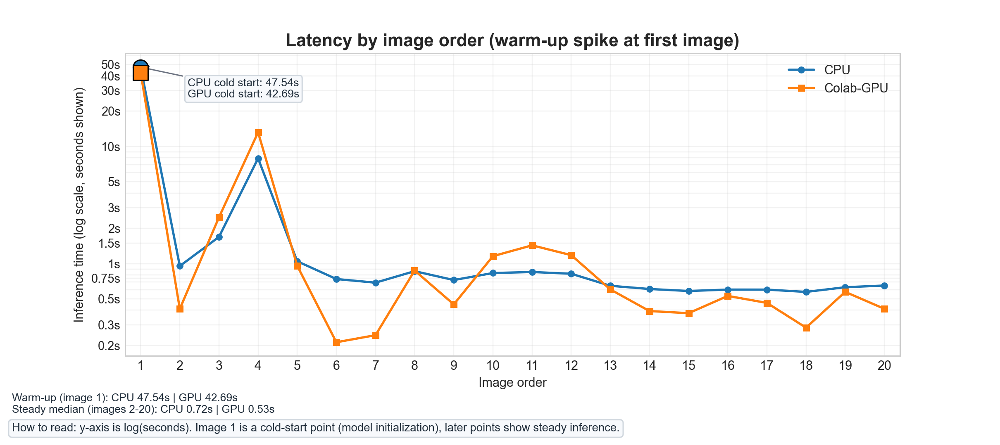
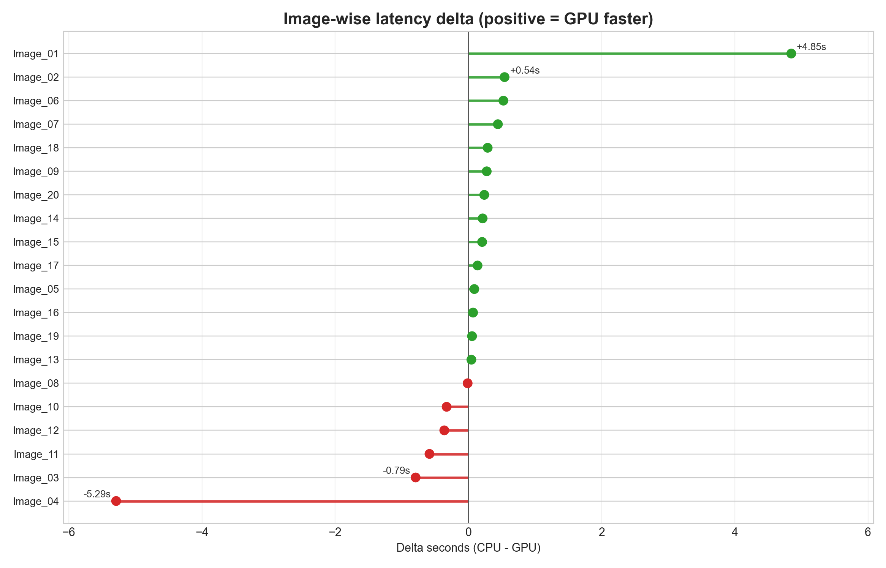
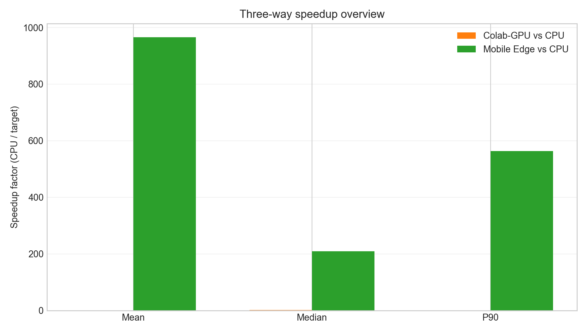
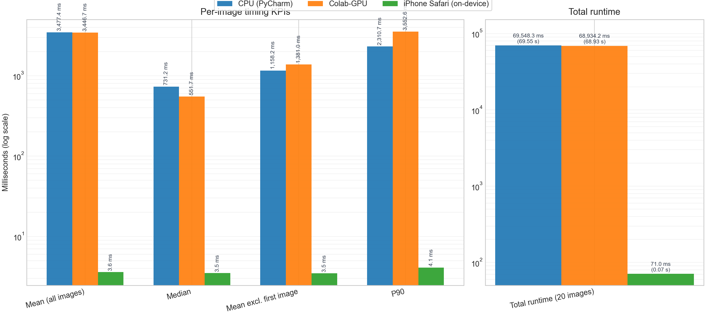

# Age, Gender, and Emotion Recognition (Local Edge Application)

[](requirements.txt)
[](requirements.txt)
[](requirements.txt)
[](requirements.txt)
[](LICENSE)
[](https://github.com/Danielkis97/Age-Gender-and-Emotion-Recognition-Local-Edge-Application/commits/main)
[](https://github.com/Danielkis97/Age-Gender-and-Emotion-Recognition-Local-Edge-Application/issues)

This project is a local computer vision app that predicts age, gender, and emotion from face images.
All inference runs on the local machine (edge-style setup), with no cloud API dependency.

## Architecture Preview

[](docs/architecture_preview.png)

PlantUML source for the same high-level structure is available in `docs/architecture.puml`.

This repository includes:

- Interactive app (`main.py`) for webcam and single-image analysis
- Batch evaluation (`evaluate.py`) with confusion matrices and CSV outputs
- Performance benchmark (`performance.py`) for CPU/GPU/Edge/TFLite comparison
- TFLite export and inference demo for mobile deployment compatibility

## System Requirements

- Python **3.12** (recommended) or **3.11**
- OS: Windows, Linux, or macOS
- Webcam only required for webcam mode

Why Python 3.12/3.11:
TensorFlow wheels are reliably available there. On newer Python versions (for example 3.13+), installation may fail with `No matching distribution found for tensorflow`.

## Quick Start

### Windows (PowerShell)

```powershell
git clone https://github.com/Danielkis97/Age-Gender-and-Emotion-Recognition-Local-Edge-Application.git
cd Age-Gender-and-Emotion-Recognition-Local-Edge-Application
.\setup.ps1
.\.venv\Scripts\python.exe main.py
```

### Linux / macOS

```bash
git clone https://github.com/Danielkis97/Age-Gender-and-Emotion-Recognition-Local-Edge-Application.git
cd Age-Gender-and-Emotion-Recognition-Local-Edge-Application
python3 -m venv .venv
source .venv/bin/activate
python -m pip install --upgrade pip
pip install -r requirements.txt
python main.py
```

## Installation Verification (Smoke Test)

Run once after setup:

```bash
python -c "import cv2, tensorflow, deepface; print('imports ok')"
```

Optional TensorFlow device check:

```bash
python -c "import tensorflow as tf; print(tf.config.list_physical_devices())"
```

## Reproducible Setup (Fresh Clone)

### Windows (PowerShell)

```powershell
cd path\to\Age-Gender-and-Emotion-Recognition-Local-Edge-Application
Remove-Item -Recurse -Force .venv -ErrorAction SilentlyContinue
if (Get-Command py -ErrorAction SilentlyContinue) { py -3.12 -m venv .venv } else { python -m venv .venv }
.\.venv\Scripts\Activate.ps1
python -m pip install --upgrade pip
pip install -r requirements.txt
```

If needed, replace `-3.12` with `-3.11` when using `py`.
The project `setup.ps1` script also supports both `py` and `python`.

If script activation is blocked:

```powershell
Set-ExecutionPolicy -Scope CurrentUser RemoteSigned
```

### Linux / macOS

```bash
cd Age-Gender-and-Emotion-Recognition-Local-Edge-Application
python3 -m venv .venv
source .venv/bin/activate
python -m pip install --upgrade pip
pip install -r requirements.txt
```

## Run the Application

Default interactive menu:

```bash
python main.py
```

Direct CLI modes:

```bash
python main.py --webcam
python main.py --image path/to/photo.jpg
```

Webcam controls:

- `q`: quit
- `p`: toggle predictions

## Evaluation (Quality Metrics)

Expected label CSV columns:

- `filename`
- `true_gender`
- `true_emotion`
- `true_age_group`

Template: [data/labels_example.csv](data/labels_example.csv)

Ground-truth note:

- The repository includes a manually labeled 20-image set in `dataset/labels.csv`
- If you use your own images or another dataset, create matching ground-truth labels first
- Without ground-truth labels, quality metrics (accuracy/precision/recall/F1) cannot be computed reliably

Run evaluation:

```bash
python evaluate.py --images_dir dataset/images --labels_csv dataset/labels.csv --out_csv results/evaluation_results.csv --predictions_csv results/predictions.csv
```

Main evaluation outputs:

- `results/evaluation_results.csv`
- `results/predictions.csv`
- `results/confusion_gender.csv`
- `results/confusion_age.csv`
- `results/confusion_emotion.csv`

## Performance Benchmark

Run benchmark:

```bash
python performance.py --images_dir dataset/images --n_runs 3 --out_csv results/performance.csv --plot results/performance_plot.png
```

Notes:

- `--no-plot` disables plot generation
- If no TensorFlow GPU is available, the GPU line is marked as simulation/fallback
- Edge in this project means local on-device execution (same host system)

## TFLite Deployment Demo

This is a deployment/performance demonstration and is **not** used for evaluation accuracy metrics.

Run export and inference:

```bash
python tflite_export.py
python tflite_inference.py --images_dir dataset/images --iterations 3 --out_csv results/tflite_performance.csv
```

Expected outputs:

- `models/model.tflite`
- `results/tflite_performance.csv`

Important separation:

- Evaluation metrics (accuracy/precision/recall/F1) are computed from the DeepFace pipeline in `evaluate.py`
- TFLite timings are deployment-oriented and independent from evaluation quality scores
- `utils/label_mapping.py` normalizes both model outputs and CSV labels into the canonical buckets used in this project:
  - gender: `Male` / `Female`
  - emotion: `Happy` / `Sad`
  - age group: `Adult` / `Elderly` (threshold at age `50`)

## Quick Validation Steps

To validate a fresh setup end-to-end:

1. Clone repository
2. Set up Python 3.12/3.11 virtual environment
3. Install dependencies from `requirements.txt`
4. Run smoke test import command
5. Run `python main.py`
6. Run evaluation command once
7. Run benchmark command once
8. Run one Mobile Edge browser test (optional but recommended)
9. Confirm output files exist under `results/`

## Mobile Edge Reproduction (iPhone Safari)

This section reproduces the on-device mobile timing run and stores results in a portable folder layout.

1. From repository root, start the local collector on your PC:

```powershell
.\.venv\Scripts\python.exe -u mobile_eval_server.py --host 0.0.0.0 --port 8000 --model_path models/model.tflite --images_dir dataset/images --out_csv "results/Results mobile metrics/mobile_browser_metrics.csv"
```

2. Find your PC LAN IP (PowerShell):

```powershell
(Get-NetIPConfiguration | Where-Object { $_.IPv4DefaultGateway -ne $null } | Select-Object -First 1).IPv4Address.IPAddress
```

3. On iPhone Safari (same Wi-Fi), open:

```text
http://<your-pc-lan-ip>:8000/mobile
```

4. In the page, click:
- `Load TFLite Model`
- `Run Benchmark and Upload Metrics`

5. Build CPU/GPU-style mobile result files:

```bash
python results/build_mobile_result_bundle.py --mobile_csv "results/Results mobile metrics/mobile_browser_metrics.csv" --out_dir "results/Results mobile metrics"
```

6. Optional KPI summary:

```bash
python results/summarize_mobile_metrics.py --csv "results/Results mobile metrics/mobile_browser_metrics.csv"
```

Notes:
- The commands are repository-relative and work regardless of your local absolute folder path.
- If you use a different output location, update `--out_csv` / `--mobile_csv` accordingly.

## Directory Structure

```text
.
├── main.py                    # Interactive entry point
├── mobile_eval_server.py      # Local server for iPhone browser timing collection
├── evaluate.py                # Batch evaluation and metrics export
├── performance.py             # CPU / GPU / Edge / TFLite benchmark
├── tflite_export.py           # Demo model export to TensorFlow Lite
├── tflite_inference.py        # TensorFlow Lite timing run
├── requirements.txt
├── setup.ps1
├── LICENSE
├── mobile_browser_test/
│   └── README_LOCAL_TEST.md
├── data/
│   └── labels_example.csv
├── dataset/
│   ├── images/
│   └── labels.csv
├── docs/
│   ├── architecture.puml
│   └── architecture_preview.png
├── models/
│   └── model.tflite
├── results/
│   ├── comparison_cpu_vs_colab.md
│   ├── comparison_cpu_gpu_mobile.md
│   ├── figures_cpu_vs_colab/
│   ├── figures_three_way/
│   ├── Results CPU PYCHARM/
│   ├── RESULTS GPU TF Google Collab/
│   ├── Results mobile metrics/
│   ├── performance.csv              
│   ├── performance_plot.png         
│   ├── tflite_performance.csv       
│   ├── generate_comparison_charts.py
│   ├── generate_three_way_comparison.py
│   ├── summarize_mobile_metrics.py
│   └── build_mobile_result_bundle.py
└── utils/
    ├── deepface_predict.py
    ├── drawing.py
    ├── face_detect.py
    └── label_mapping.py
```

## Troubleshooting

### `ModuleNotFoundError: No module named 'tensorflow'`

Likely cause: wrong interpreter. Use the project virtual environment interpreter explicitly.

Windows:

```powershell
.\.venv\Scripts\python.exe main.py
```

### `ImportError: Could not find the DLL(s) 'msvcp140.dll' or 'msvcp140_1.dll'`

Install the Microsoft Visual C++ Redistributable (x64), then re-open the terminal and retry:

```powershell
winget install --id Microsoft.VCRedist.2015+.x64 -e --source winget --accept-source-agreements --accept-package-agreements
```

### `No matching distribution found for tensorflow`

Use Python 3.12 or 3.11, recreate `.venv`, then reinstall dependencies.

### TensorFlow does not detect GPU on native Windows

For TensorFlow >= 2.11, native Windows GPU support is limited.
Use CPU, WSL2, or TensorFlow-DirectML if GPU acceleration is required.

### `Activate.ps1` blocked by execution policy

Run:

```powershell
Set-ExecutionPolicy -Scope CurrentUser RemoteSigned
```

### No faces detected during evaluation or TFLite timing

- Use clear front-facing images
- Improve lighting and image quality
- Verify that `dataset/images` contains supported formats (`.jpg`, `.jpeg`, `.png`, `.bmp`, `.webp`)

### Webcam window does not open

- Check whether another application is already using the camera
- On Windows, verify camera permissions in system settings
- If the OpenCV window appears behind the IDE, look for it in the taskbar

### First run is much slower than later runs

- This is expected for model initialization and one-time setup work
- Use median or warm-up-aware timing values for a fairer comparison

### DeepFace downloads weights on first use

- The first execution may take longer because pretrained files are cached locally
- Re-running the same command should be noticeably faster after the initial download

## CPU vs Colab-GPU vs Mobile Edge Comparison

The repository includes a documented three-way comparison between:

- local CPU run in PyCharm
- Google Colab GPU run
- iPhone Safari on-device Mobile Edge run

All related assets are stored in `results/figures_cpu_vs_colab/`, with the written summary in [results/comparison_cpu_vs_colab.md](results/comparison_cpu_vs_colab.md).
An additional compact report is available in [results/comparison_cpu_gpu_mobile.md](results/comparison_cpu_gpu_mobile.md).

High-level outcome:

- CPU and Colab-GPU quality metrics were identical across the reported scopes
- Mean inference time per image: `3477.40 ms` (CPU), `3446.70 ms` (Colab-GPU), `3.60 ms` (Mobile Edge)
- Median inference time: `731.17 ms` (CPU), `551.69 ms` (Colab-GPU), `3.50 ms` (Mobile Edge)
- Mobile Edge is timing-focused in this demo path; quality comparison is shown for CPU/GPU only
- Warm-up and image-level latency variation remain clearly visible in per-image charts

The comparison charts can be regenerated with:

```bash
python results/build_mobile_result_bundle.py --mobile_csv "results/Results mobile metrics/mobile_browser_metrics.csv" --out_dir "results/Results mobile metrics"
python results/generate_comparison_charts.py
```

### Scope and practical limitation (mobile path)

- The iPhone run is real on-device browser inference and is valid for latency/throughput benchmarking.
- In this repository, full quality metrics (accuracy/precision/recall/F1) are produced by the DeepFace desktop pipeline (CPU/GPU runs).
- Getting exactly the same quality outputs in a mobile browser would require browser-ready models for face, age, gender, and emotion, plus a full re-check against ground truth and likely calibration/retraining.
- In this project, the practical trade-off is clear: mobile gives fast and reproducible on-device timing, while full quality metrics come from the desktop DeepFace evaluation pipeline.

### Comparison Figures

#### 1) Quality overview



#### 2) Timing KPI comparison



#### 3) Latency distribution



#### 4) Latency by image order



#### 5) Image-wise latency delta



#### 6) Three-way timing snapshot (values shown)



### Additional three-way figure bundle

The same comparison suite is also exported to `results/figures_three_way/` and includes:

- `01_quality_parity_panel.png`
- `01_timing_kpis_three_way.png`
- `02_timing_dumbbell_clean.png`
- `03_latency_distribution_boxstrip.png`
- `04_latency_by_image_order.png`
- `05_image_delta_lollipop.png`
- `06_three_way_speedup_panel.png`

#### 7) Annotated three-way timing KPIs



## Contributing

Contributions are welcome.

1. Fork the repository
2. Create a feature branch
3. Open a pull request with a short summary and test notes

Please keep documentation and commit messages in English.

## License

This project is licensed under the [MIT License](LICENSE).

## Limitations

- Prediction quality depends on image quality and lighting
- Pretrained models can have demographic bias
- Small test datasets may not generalize

## Development Environment

The code for this project was developed using PyCharm, which offers a powerful IDE for Python development.

