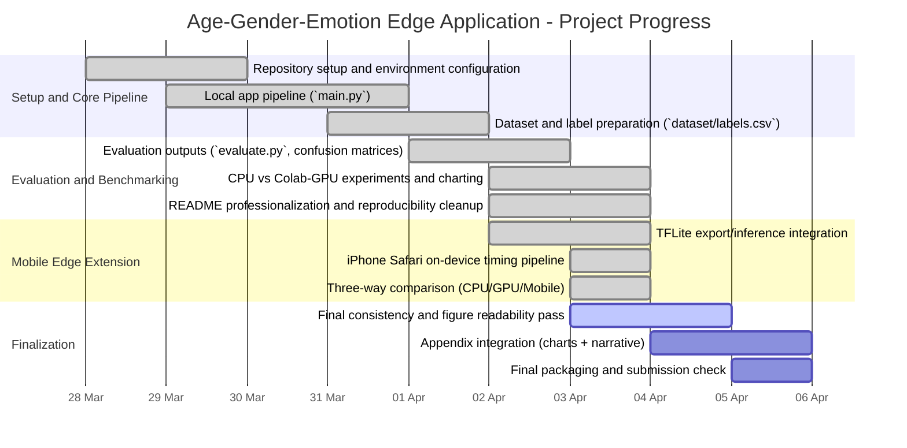

# Appendix: Project Progress Gantt Chart

The following timeline summarizes the implementation and validation progress of the project.
Use this as an appendix figure or progress reference.

## Notes

- This chart reflects the current project state and can be updated with exact institutional milestone dates.
- If your report requires strict calendar precision, replace the start dates/durations with your official schedule.
